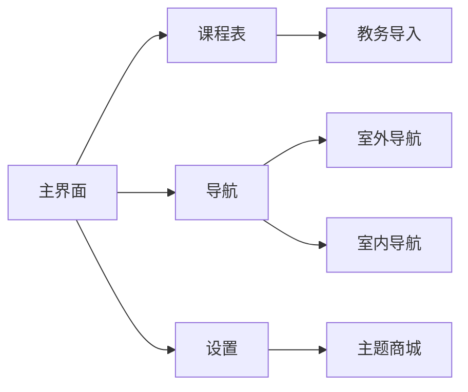

# ​**​北邮校园通 - CampusLink​**​  
​**​📱 你的智能校园生活助手 | 北邮专属版​**​  

---

## ​**​✨ 核心功能​**​  

### ​**​1. 📅 智能课程表系统​**​  
- ​**​一键导入课表​**​：支持从 ​**​北邮教务系统​**​ 直接同步课程（免手动输入）。  
- ​**​个性化定制​**​：  
  - 自定义背景（主题色/图片）  
  - 课程标签分类（必修/选修/实验课）  
  - 日程提醒（提前15分钟弹窗+震动）  
- ​**​“去上课”导航​**​：点击课程直接跳转 ​**​北邮地图导航​**​。  

---

### ​**​2. 🗺️ 北邮智能导航​**​  
- ​**​多模式路径规划​**​：  
  | 模式       | 优化目标          | 适用场景          |  
  |------------|-------------------|-------------------|  
  | 🚶 ​**​行人​**​  | 最短路径          | 日常上课          |  
  | 🚴 ​**​骑车​**​  | 避开陡坡          | 校园内快速移动    |  
  | ⏱️ ​**​最短时间​**​ | 动态避开拥堵      | 赶课/紧急情况     |  
- ​**​室内导航​**​：  
  - 进入教学楼后自动切换楼层平面图。  
  - ​**​高亮标注目标教室​**​（如“教3-201”）。  

---

### ​**​3. 🌐 智慧识图（Beta）​**​  
- ​**​无需数据库​**​：仅需上传任意学校地图图片，自动解析：  
  - 🖌️ 基于颜色块识别道路/建筑。  
  - 🧩 自动生成可导航路径（支持A*算法优化）。  
- ​**​兼容性​**​：适配90%+高校手绘地图/电子地图。  

---

## ​**​🎨 UI 设计亮点​**​  

## ​**​🛠️ 技术栈​**​  
| 模块            | 技术方案                                                                 |
|-----------------|--------------------------------------------------------------------------|
| ​**​前端框架​**​    | QT 6（跨平台支持 Windows/macOS/Linux）                                    |
| ​**​核心语言​**​    | C++ 17（高性能导航计算/地图解析）                                        |
| ​**​导航算法​**​    | A*（室外路径）+ Dijkstra（室内楼层导航）+ QLearning（智慧识图动态优化） |
| ​**​地图解析​**​    | OpenCV 4.5（图像处理）+ QT Canvas（实时渲染）                           |
| ​**​数据同步​**​    | 北邮教务API（基于QT Network模块的HTTPS请求）                             |
| ​**​并发处理​**​    | QT Concurrent（多线程路径计算）+ SQLite（本地课程存储）                 |
| ​**​特色功能​**​    | QT Quick Controls 2（现代化UI）+ QML（动态主题切换）                   |
